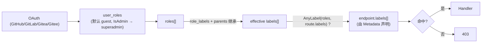
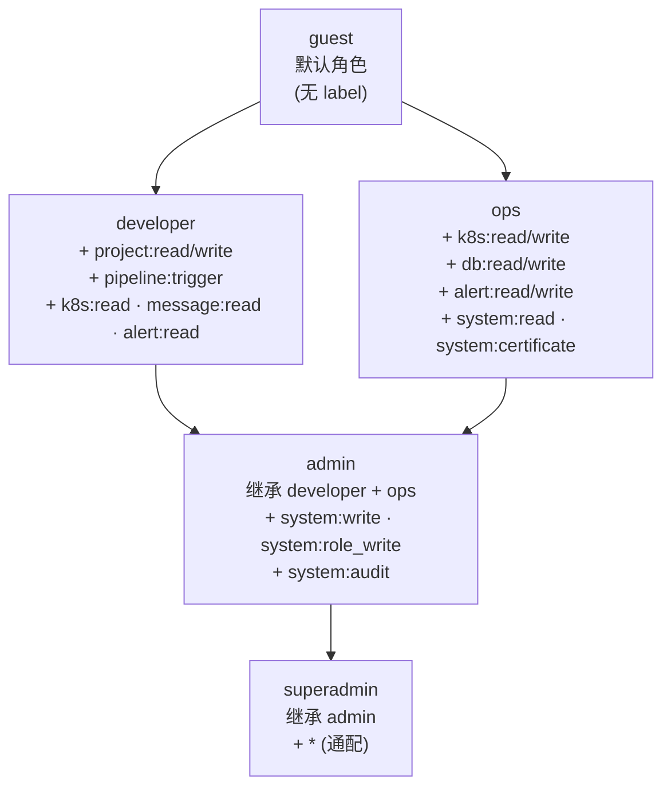
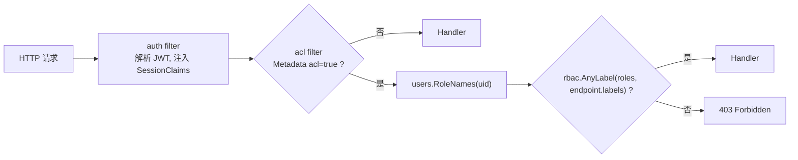
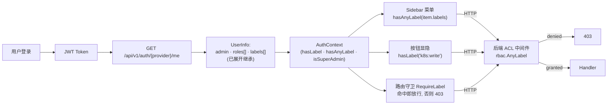

# 权限模型 (RBAC)

> 使用 [gorbac/v2](https://github.com/mikespook/gorbac), 采用 **label 标签**
> 风格的权限分配: 每个 API endpoint 在注册时声明所属 `labels: []string`,
> role 拥有一组 labels, 二者交集非空即放行 (类似 K8s label selector).

> **核心原则**: OAuth 登录 → user → roles → labels → endpoint.labels.
> 前端菜单 / 按钮 / 路由 与后端 ACL 中间件**消费同一份 label 列表**, 同一来源,
> 双重校验.

## 1. 链路总览



`superadmin` 角色拥有通配 label `*`, ACL 中间件遇到 `*` 直接放行.

## 2. label 与 metadata 包 (`internal/label/`)

`label/label.go` 集中维护两类常量:

- **Metadata 键**: `MetaACL`、`MetaLabels`、`MetaModule`、`MetaRemark`.
- **内置 label**: 命名 `<module>:<action>`, 如 `K8sRead = "k8s:read"`、
  `K8sWrite = "k8s:write"`、`SystemCertificate = "system:certificate"` 等.
- **内置 role**: `RoleSuperadmin / RoleAdmin / RoleOps / RoleDeveloper / RoleGuest`.

`AllLabels()` / `AllRoles()` 返回 seed 数据, `service/migrate/migrate.go`
`seedRBAC()` 会在每次启动时 idempotently upsert 到 `labels` / `roles` /
`role_labels` 表, 内置 role 的 label 集合会被覆盖回默认值 (避免被运维误改).

## 3. 数据模型

```go
type Role struct {
    ID      int64
    Name    string  // gorbac roleID, 例如 "ops"
    Title   string
    Parents string  // 逗号分隔, e.g. "developer,ops"
    Builtin bool
    Labels  []Label `gorm:"many2many:role_labels"`
}
type Label struct {
    ID     int64
    Name   string  // gorbac permissionID, 例如 "k8s:read"
    Title  string
    Module string  // UI 分组, "K8s 管理" / "系统管理" / ...
    Builtin bool
}
type Endpoint struct {
    ID     int64
    Path   string  // go-restful 路径模板, "/api/v1/admin/k8s/clusters"
    Method string
    Module string
    Remark string
    Labels []Label `gorm:"many2many:endpoint_labels"`
}
type UserRole struct {
    UserID int64 `gorm:"primaryKey"`
    RoleID int64 `gorm:"primaryKey"`
}
```

`endpoints` 表是**只读副本**, 由 `internal/router.Sync` 在服务启动后遍历
`restful.DefaultContainer.RegisteredWebServices()` 自动同步; 它仅供管理后台
"接口目录" 标签页展示, 实际鉴权读取的是路由 Metadata.

## 4. 路由声明权限

```go
ws.Route(ws.GET("/clusters").To(r.listClusters).
    Doc("List kubernetes clusters").
    Metadata(restfulOpenapi.KeyOpenAPITags, tags).
    Metadata(label.MetaACL, true).
    Metadata(label.MetaLabels, []string{label.K8sRead}).
    Metadata(label.MetaModule, label.ModuleK8s).
    ...)
```

约定:

- `MetaACL=true` 且 `MetaLabels=[]string{...}` → ACL 中间件参与鉴权.
- 同一个 endpoint 可声明多个 label, **任一**命中即放行 (OR 语义).
- 未声明 ACL 的路由仅依赖 auth 中间件 (登录即可访问), 例如 `/api/v1/auth/{provider}/me`.

### 内置 label ↔ 路由示例

| Label | Method + Path | 模块 | 用途 |
|-------|--------------|------|------|
| `k8s:read` | `GET /api/v1/admin/k8s/clusters` 等 | K8s 管理 | K8s 资源只读 |
| `k8s:write` | `POST /api/v1/admin/k8s/clusters/{id}/resources/apply` | K8s 管理 | K8s 资源写入 |
| `project:read` | `GET /api/v1/repos[/...]` | 项目管理 | 仓库 / 流水线只读 |
| `project:write` | `POST /api/v1/repos/sync` 等 | 项目管理 | 仓库同步 / 配置变更 |
| `pipeline:trigger` | `POST /api/v1/repos/{id}/pipeline/run` | 项目管理 | 触发流水线、审批 |
| `system:certificate` | `… /api/v1/sys/certificates[/{id}]` | 系统管理 | 凭证管理 |
| `system:role_write` | `… /api/v1/rbac/*` | 系统管理 | 角色 / 用户角色 CRUD |
| `system:audit` | `… /api/v1/audit/*` (规划中) | 系统管理 | 操作审计 |
| `*` | 任意 | 系统管理 | 仅 superadmin |

## 5. 内置角色与继承关系



`Role.Parents` 字段以逗号分隔存储, gorbac `SetParents` 在 `RBAC.Rebuild()`
时按图重建. `RBAC.EffectiveLabels(roles)` 利用 gorbac `Walk` 展开父链得到
全部 label, 缓存供前端 `/me` 接口和 ACL 中间件复用.

## 6. Auth + ACL 中间件链



注册顺序在 `cmd/wire/wire.go::InjectedHandler` 中固定为
`auth → acl → admin (兼容遗留) → metrics`.
`admin` 中间件保留以便短期内仍兼容 `Metadata("admin", true)` 的旧路由,
`Metadata(label.MetaACL, true)` 全量铺开后即可移除.

## 7. OAuth 登录与角色分配

不再依赖 LDAP group 自动映射. 采用**手动分配 + IsAdmin 自动晋升**:

```mermaid
flowchart TD
  L["OAuth 登录"] --> U["UpsertGitUser"]
  U -->|首次登录 + IsAdmin=false| G["分配 guest 角色"]
  U -->|首次登录 + IsAdmin=true|  S1["分配 superadmin 角色"]
  U -->|已存在 + IsAdmin=true|    S2["补齐 superadmin 角色 (不降级)"]
  U -->|已存在 + 普通用户|         NOOP["不动 user_roles"]
  G & S1 & S2 & NOOP --> ME["GET /me\n返回 roles + 已展开的 labels"]
```

后续运维人员在 **系统管理 → 角色管理 → 用户授权** 标签页给指定用户分配
其它角色 (例如 `ops` / `developer`). 角色变更后 ACL 中间件下次请求即生效
(`gorbac` 内存图通过 `RBAC.Rebuild()` 热更新).

## 8. 前端统一权限流程



```jsx
// 前端 utils/permission.js
import { useAuth } from 'context/AuthContext';

const SaveBtn = () => {
  const { hasLabel } = useAuth();
  return (
    <Button disabled={!hasLabel('k8s:write')}>保存</Button>
  );
};

// 路由守卫
<RequireLabel labels={['system:role_write']}>
  <SystemRoles />
</RequireLabel>
```

`labels = ['*']` 时 `hasLabel` / `hasAnyLabel` 始终为 true (superadmin 无视
任何检查). 后端在 `service/auth.buildUserInfo()` 中调用 `RBAC.EffectiveLabels`
预先展开父链, 前端无需理解继承关系.

## 9. 管理后台 API

`/api/v1/rbac/*` 全部声明 `Metadata(label.MetaLabels, []string{label.SystemRoleWrite})`,
仅 admin / superadmin 可访问:

| Method | Path | 用途 |
|--------|------|------|
| GET | `/api/v1/rbac/roles` | 列出所有角色 |
| POST | `/api/v1/rbac/roles` | 新建角色 |
| PUT | `/api/v1/rbac/roles/{id}` | 编辑角色 |
| DELETE | `/api/v1/rbac/roles/{id}` | 删除角色 (内置角色禁止) |
| GET | `/api/v1/rbac/labels` | 列出 label 目录 |
| GET | `/api/v1/rbac/endpoints` | 列出已自动同步的接口目录 |
| GET | `/api/v1/rbac/users` | 列出用户及其角色 |
| PUT | `/api/v1/rbac/users/{id}/roles` | 修改用户角色 |

每次写操作完成后 `service/rbac` 调用 `RBAC.Rebuild()` 立即重建 gorbac
内存图, 无需重启服务.

## 10. 上线顺序与回滚

按以下顺序灰度落地, 避免线上鉴权空窗:

1. **Schema + seed**: 部署带 `seedRBAC` 的迁移脚本; 此时尚未启用 ACL 中间件, 无影响.
2. **接 `/me` 返回 roles + labels**: 前端 AuthContext 消费这两个字段, 但菜单不强制过滤.
3. **角色管理 UI 上线**: admin 在 UI 上完成历史用户的角色分配.
4. **批量打 Metadata + 启用 ACL 中间件**: 一次性给所有路由打 `MetaACL/MetaLabels`,
   wire 中加入 `aclmw`, 同步删除路由 handler 中遗留的 `ensureAdmin` 检查.
5. **前端菜单 / 路由守卫按 label 过滤**: 普通用户只能看到自己有权限的入口.

回滚: 保留 `admin` 中间件 + `User.Admin` 字段, 通过移除路由的 `MetaACL=true`
即可旁路 ACL, fall back 到旧的 `user.Admin` 二元授权.
